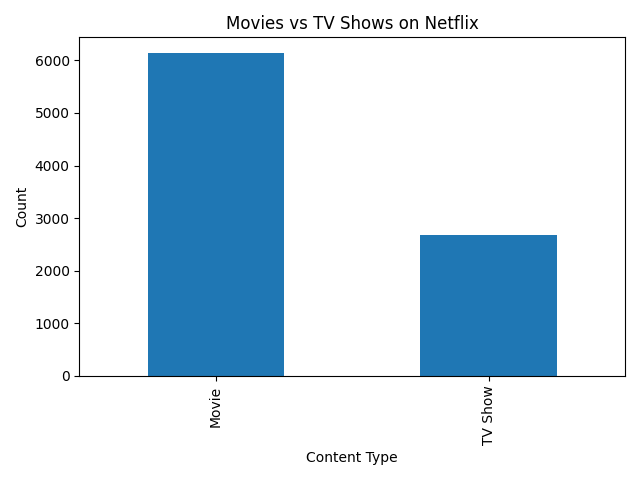
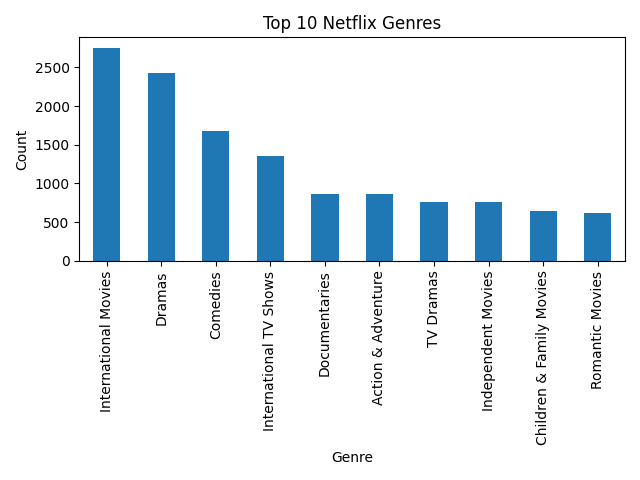

# Netflix Data Analysis Project

## Project Overview
This project performs exploratory data analysis (EDA) on Netflix content data using Python.

The analysis includes:
- Movies vs TV Shows distribution
- Top Netflix genres
- Content trend analysis
- Data visualization

## Dataset
Netflix Movies and TV Shows dataset sourced from Kaggle:

Dataset Link:  
https://www.kaggle.com/datasets/shivamb/netflix-shows

## Technologies Used
- Python
- Pandas
- Matplotlib

## Features
- Data cleaning and preprocessing
- Exploratory data analysis
- Genre analysis
- Visualization charts

## Dataset
Netflix Movies and TV Shows dataset from Kaggle.

## Project Structure

```bash
netflix-data-analysis/
│
├── data/
│   └── netflix_titles.csv
│
├── images/
│   ├── content_type_chart.png
│   └── top_genres_chart.png
│
├── notebook/
│
├── src/
│   └── analysis.py
│
├── main.py
├── README.md
├── requirements.txt
└── .gitignore
```

## How to Run

Install dependencies:

```bash
pip install -r requirements.txt
```

Run the project:

```bash
python main.py
```

## Output
The project generates:
- Movies vs TV Shows chart
- Top genres chart
- Dataset insights

## Future Improvements
- Interactive dashboard
- Recommendation system
- Trend analysis by year
- Streamlit web application

## Author
Surya Koushik Palla


## Visualizations

### Movies vs TV Shows


### Top Netflix Genres

